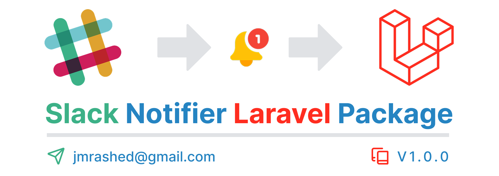

<!--image  -->


# Laravel Slack Notifier Package

A simple package to send notifications to Slack using webhooks, with support for customizations such as multiple webhooks, channels, bot name, emojis, and more.

## Table of Contents
- [Installation](#installation)
- [Configuration](#configuration)
- [Usage](#usage)
  - [Send Message](#send-message)
  - [Report Exceptions](#report-exceptions)
  - [Dump Variables](#dump-variables)
  - [Multiple Webhooks](#multiple-webhooks)
  - [Send Message to Another Channel](#send-message-to-another-channel)
  - [Customize Slack Bot](#customize-slack-bot)
  - [Message Formatting](#message-formatting)
  - [Additional Context](#additional-context)
  - [Exception Stack Trace Filtering](#exception-stack-trace-filtering)
  - [Cache Same Exceptions](#cache-same-exceptions)
- [Testing](#testing)
- [License](#license)

## Installation

To install the package, run the following composer command:

```bash
composer require jmrashed/laravel-slack-notifier
```

### Configuration

Once the package is installed, you need to set up the environment variables for the Slack webhook and other configuration options.

Add the following entries to your `.env` file:

```dotenv
APP_NAME=Laravel
LOG_SLACK_WEBHOOK_URL=https://hooks.slack.com/services/ABC
LOG_SLACK_CHANNEL=
LOG_SLACK_EMOJI=:boom:
LOG_SLACK_CACHE_SECONDS=0
```

- `LOG_SLACK_WEBHOOK_URL` is **required** and should be set to your Slack webhook URL. [Learn how to create a webhook](https://api.slack.com/messaging/webhooks).
- The other environment variables are optional. You can set `LOG_SLACK_CHANNEL` to specify a channel or use `LOG_SLACK_EMOJI` to set a custom emoji for the Slack messages.

To temporarily disable notifications, either comment out or set the `LOG_SLACK_WEBHOOK_URL` to an empty string or `null`.

Optionally, you can publish the config file with the following Artisan command:

```bash
php artisan vendor:publish --tag="slack-notifier"
```

## Usage

### Send Message

To send a message to Slack, use the following code:

```php
use Jmrashed\SlackNotifier\Facades\SlackNotifier;

SlackNotifier::send('Test message');
```

You can also send exceptions:

```php
SlackNotifier::send(new \RuntimeException('Test exception'));
```

### Report Exceptions

To automatically report exceptions to Slack, configure your Laravel exception handler.

#### Laravel 11.x and later
In `bootstrap/app.php`:

```php
return Application::configure(basePath: dirname(__DIR__))
    ->withExceptions(function (Exceptions $exceptions) {
        $exceptions->reportable(function (Throwable $e) {
            \Jmrashed\SlackNotifier\Facades\SlackNotifier::send($e);
        });
    })->create();
```

#### Laravel 8.x, 9.x, and 10.x
In `app/Exceptions/Handler.php`:

```php
public function register(): void
{
    $this->reportable(function (Throwable $e) {
        \Jmrashed\SlackNotifier\Facades\SlackNotifier::send($e);
    });
}
```

#### Laravel 7.x
In `app/Exceptions/Handler.php`:

```php
public function report(Throwable $exception)
{
    if ($this->shouldReport($exception)) {
        \Jmrashed\SlackNotifier\Facades\SlackNotifier::send($exception);
    }

    parent::report($exception);
}
```

#### Laravel 5.x, 6.x
In `app/Exceptions/Handler.php`:

```php
public function report(Exception $exception)
{
    if ($this->shouldReport($exception)) {
        \Jmrashed\SlackNotifier\Facades\SlackNotifier::send($exception);
    }

    parent::report($exception);
}
```

### Dump Variables

You can also send variables (strings, arrays, objects) to Slack:

```php
use Jmrashed\SlackNotifier\Facades\SlackNotifier;

$variable = 'message';  // or $variable = ['key' => 'value'];
SlackNotifier::send($variable);
```

### Multiple Webhooks

You can configure multiple webhook URLs in the `config/slack-notifier.php` file:

```php
// config/slack-notifier.php

'webhook_urls' => [
    'default' => 'https://hooks.slack.com/services/ABC',
    'testing' => 'https://hooks.slack.com/services/DEF',
],
```

To use a specific webhook, specify the webhook name:

```php
use Jmrashed\SlackNotifier\Facades\SlackNotifier;

SlackNotifier::to('testing')->send('Test message');
```

### Send Message to Another Channel

To send a message to a different Slack channel, use the `channel` method:

```php
use Jmrashed\SlackNotifier\Facades\SlackNotifier;

SlackNotifier::channel('reminders')->send('Test message');
```

### Customize Slack Bot

You can customize the bot’s name and emoji:

```php
use Jmrashed\SlackNotifier\Facades\SlackNotifier;

SlackNotifier::username('My Laravel Bot')->emoji(':tada:')->send('Test message');
```

### Message Formatting

If you need to format the message before sending, extend the default `SlackNotifierFormatter` class:

```php
// config/slack-notifier.php

'formatter' => App\Formatters\CustomSlackNotifierFormatter::class,
```

### Additional Context

You can include additional context in the message. Use the `context` method to pass additional information as an attachment in the message.

### Exception Stack Trace Filtering

Filter out unnecessary stack trace lines (e.g., from framework files) by configuring the `dont_trace` option in the config.

### Cache Same Exceptions

To avoid logging the same exception multiple times, use the `LOG_SLACK_CACHE_SECONDS` configuration. It defines how long exceptions will be cached before being logged again.

Alternatively, you can specify the cache duration programmatically:

```php
use Jmrashed\SlackNotifier\Facades\SlackNotifier;

SlackNotifier::cacheSeconds(60)->send(new \RuntimeException('Test exception'));
```

## Testing

To run the tests for this package, use the following command:

```bash
composer test
```

## License

This package is licensed under the MIT License. See the [License File](LICENSE.md) for more details. 